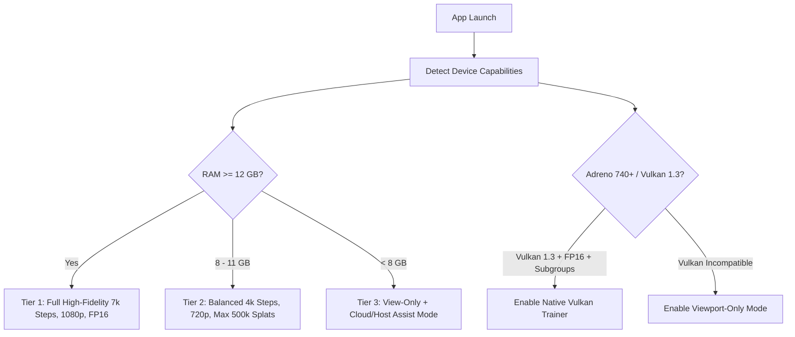

# Mobile 3D Gaussian Splatting (3DGS)
# Complete End-to-End Standalone Android Engineering Master Plan

**Version:** 1.0  
**Status:** Engineering Master Plan  
**Date:** September 2026  
**Target Hardware:** Qualcomm Snapdragon 8 Gen 2 (Adreno 740 GPU, 12 GB RAM, ARM64 `arm64-v8a`, Android 16)  
**Execution Paradigm:** **100% Standalone On-Device** (Zero Cloud / Zero Desktop / Zero CUDA Server / Zero Internet Required)

---

## 1. Executive Summary & Architecture Overview

The goal of this project is to deliver a **100% self-contained Android application** that performs the entire 3D Gaussian Splatting lifecycle directly on the mobile device. The phone's camera, IMU, ARCore SLAM engine, and Adreno 740 GPU work in unison to capture, filter, optimize, render, edit, measure, and project 3D Gaussian Splats back into the physical world.

```mermaid
graph TD
    subgraph 1. Capture & Tracking
        A[Camera Stream CameraX / NDK] --> B[ARCore 6-DoF VIO Tracking]
        B --> C[Pose Matrix C2W + Intrinsics K]
        A --> D[Real-time Frame Quality Gate]
        D -->|Laplacian Blur + Exposure + Overlap| E[Keyframe Selection & Dome Coverage]
    end

    subgraph 2. Geometry & Gaussian Initialization
        B --> F[ARCore Depth & Feature Point Cloud]
        E --> G[On-Device Point Cloud Seeding]
        F --> G
        G --> H[3D Gaussian Param Initialization]
        H -->|Pos, Scale, Quat, Opacity, SH0| I[Initial Gaussian State Tensor]
    end

    subgraph 3. On-Device GPU Training (Adreno 740)
        I --> J[Native Vulkan Compute Engine libbrush_c.so]
        J --> K[Forward Tile Rasterizer & Radix Sort]
        K --> L[Loss Computation L1 + SSIM]
        L --> M[Backward Compute Shader Gradients]
        M --> N[Densification, Splitting & Floater Pruning]
        N -->|Iterative Loop 2k-7k Steps| J
    end

    subgraph 4. Interaction, Viewport & Augmented Reality
        N -->|Trained 32-Byte .splat| O[Real-time 60 FPS Vulkan/OpenGL Viewport]
        O --> P[Interactive Editing & 3D Bounding Crop]
        O --> Q[Metric Distance & Scale Measurement]
        O --> R[ARCore World Relocalization & AR Placement]
        O --> S[Export .splat / .ply / .ksplat]
    end
```

---

## 2. Pinned Toolchain & Environment Baseline

All development, compilation, and native builds must strictly adhere to the pinned baseline:

| Subsystem | Specification / Version | Rationale & Rules |
| :--- | :--- | :--- |
| **Operating System** | Android 16 (API Level 36) | Target & compile SDK pinned to 36; minimum SDK 28 (Android 9.0). Do not use preview API 37. |
| **IDE** | Android Studio Quail 4 (2026.1.4) | Standardized development environment. |
| **Android Gradle Plugin** | AGP `9.4.0` | Production build system. |
| **Gradle** | `9.6.0` | Matching build runner. |
| **JDK** | `JDK 17` (or bundled Android Studio JBR 21) | Strict reproducible compilation. |
| **Kotlin** | `2.3.21` | Modern Kotlin compiler with coroutines. |
| **Android NDK** | Pinned `29.0.14206865` (NDK r29) or LTS `27.3.13750724` (NDK r27d) | Consistent ABI compilation; no `latest` or dynamic versions. |
| **Target Architecture** | `arm64-v8a` exclusively | Optimizations tailored for 64-bit ARM NEON and Vulkan 1.3. 32-bit `armeabi-v7a` and `x86` omitted. |
| **Google ARCore** | Pinned exact tested release (e.g. `1.48.0` / `1.41.0`) | Deterministic VIO tracking APIs without breaking changes. |
| **App Shell UI** | Kotlin Jetpack Compose / Native Android | High-performance, zero-overhead UI without heavy framework bridges. |

---

## 3. Subsystem Breakdown (The 14 Core Capabilities)

### Capability 1 & 4: Camera Capture, Poses & Dynamic Intrinsics
- **Camera Pipeline**: High-speed camera frame streaming via Android CameraX / Camera2 NDK delivering $1080\text{p} \ (1920\times 1080)$ at 30/60 FPS.
- **ARCore 6-DoF VIO Tracking**:
  - Extract camera extrinsics $T_{\text{world}\leftarrow\text{camera}} = \begin{bmatrix} R & t \\ 0 & 1 \end{bmatrix}$ directly from `frame.androidSensorPose` and `frame.camera.displayOrientedPose`.
  - Extract exact pinhole intrinsics per frame: focal lengths $(f_x, f_y)$, principal point $(c_x, c_y)$, and sensor dimension:
    $$K = \begin{bmatrix} f_x & 0 & c_x \\ 0 & f_y & c_y \\ 0 & 0 & 1 \end{bmatrix}$$
- **Metric Scale Guarantee**: ARCore provides physical real-world scale in meters (1 unit = 1 meter), eliminating the arbitrary scale factor inherent to standalone COLMAP.

---

### Capability 3 & 5: Frame Quality Filter & Geodesic Dome Coverage
Before sending frames into memory for optimization, every frame passes through a real-time, zero-copy quality filter:
1. **Motion Blur Detector**:
   - Computes Laplacian variance on the camera luminance buffer:
     $$\text{Blur Metric} = \text{Var}(\nabla^2 I) = \frac{1}{N}\sum (L(x,y) - \mu_L)^2, \quad \text{threshold } \tau_{\text{blur}} \ge 100.0$$
   - Discards frames blurred by rapid hand movement or shake.
2. **Exposure & Contrast Validator**:
   - Evaluates luminance histogram: rejects overexposed (clipped highlights $> 95\%$) and underexposed ($< 5\%$) frames.
3. **Geodesic Dome Coverage Planner**:
   - Calculates the bounding center of the target object.
   - Plots virtual target nodes along 3 elevation rings ($15^\circ, 45^\circ, 75^\circ$) around the object.
   - Requires minimal angular displacement ($\Delta \theta \ge 5^\circ$) or translation ($\Delta d \ge 5\text{ cm}$) from previous keyframes to prevent redundant frames and memory bloat.
   - UI gives real-time visual feedback (green/red indicators) to guide the user to complete full $360^\circ$ hemispherical coverage.

---

### Capability 6 & 7: On-Device Pose Refinement & Initial Geometry Seeding
- **ARCore Point Cloud Ingestion**:
  - ARCore generates high-confidence 3D feature points using `frame.acquirePointCloud()`.
  - Points with confidence score $> 0.5$ are accumulated into a global spatial hash grid.
- **Sparse Geometric Initialization**:
  - The accumulated point cloud provides $N_{\text{init}} \approx 5,000 \dots 20,000$ real-world 3D points.
  - Unlike random point clouds, ARCore points already approximate the real surface geometry and provide absolute metric bounds.

---

### Capability 8: 3D Gaussian Parameter Initialization
Each point $i$ in the initial point cloud is converted into a 3D Gaussian primitive:
1. **Position**: $\mu_i = [x_i, y_i, z_i]^T \in \mathbb{R}^3$.
2. **Covariance / Scale**:
   - Compute mean distance to the $k=3$ nearest neighbors: $d_i = \frac{1}{k} \sum_{j=1}^k \|\mu_i - \mu_j\|$.
   - Initialize log-scale: $s_i = [\ln(d_i), \ln(d_i), \ln(d_i)]^T$.
3. **Rotation**: Normalized unit quaternion $q_i = [1.0, 0.0, 0.0, 0.0]^T$ (identity rotation).
4. **Opacity**: Initialized to low transparency to allow smooth optimization:
   $$\text{logit}(\alpha_i) = \ln\left(\frac{0.1}{1.0 - 0.1}\right) \approx -2.197$$
5. **Color & Spherical Harmonics ($SH_0$)**:
   - Sample pixel RGB color from keyframes corresponding to point projection.
   - Convert to 0th-order SH coefficient:
     $$c_{0} = \frac{\text{RGB} - 0.5}{0.28209479}$$

---

### Capability 9: On-Device Optimization & Training (Adreno 740 GPU)
*Execution Engine: Embedded Rust Burn / WGPU / Vulkan Compute (`libbrush_c.so` + `brush_bridge.cpp`)*

#### Hardware Adaptation for Snapdragon 8 Gen 2 / Adreno 740:
- **Vulkan 1.3 Compute Pipeline**: Direct dispatch to Adreno 740 GPU.
- **FP16 Half-Precision Optimization**:
  - Utilize `VK_KHR_shader_float16_int8` for 2x ALU throughput on mobile tensors.
- **Subgroup Tile Reductions**:
  - Leverage Adreno wave size (subgroups of 64 or 128 threads) for zero-shared-memory reduction during radix sort and tile blending.
- **Forward Differentiable Splatting**:
  - Project 3D Gaussian covariance into 2D camera plane:
    $$\Sigma_{2D} = J W \Sigma W^T J^T$$
  - Assign splats to screen-space tiles ($16 \times 16$ pixels).
  - High-speed GPU radix sort by tile ID and 64-bit depth key.
  - Front-to-back alpha compositing:
    $$C(p) = \sum_{i \in \mathcal{N}} c_i \alpha_i \prod_{j=1}^{i-1} (1 - \alpha_j)$$
- **Backward Gradient Compute Shaders**:
  - Analytical gradients for position ($\nabla_\mu$), scale ($\nabla_s$), rotation ($\nabla_q$), opacity ($\nabla_\alpha$), and color ($\nabla_c$).
- **Adaptive Densification & Pruning**:
  - Positional gradient threshold: $\nabla_{2D} > 0.0002$.
  - Clone under-reconstructed Gaussians ($s < \tau_{\text{scale}}$).
  - Split over-reconstructed Gaussians ($s > \tau_{\text{scale}}$) into two child Gaussians with scale reduced by $\frac{1}{1.6}$.
  - Floater pruning: cull Gaussians with $\alpha < 0.04$ or scale exceeding scene bounding box radius.
- **Training Budget**:
  - Preset: Fast (2,000 steps, ~60s), Balanced (5,000 steps, ~2.5 min), High Fidelity (7,000 steps, ~4 min).
  - Battery & Thermal throttling guards: Pause training if device temperature exceeds $42^\circ\text{C}$ or battery drops below $15\%$.

---

### Capability 10: Real-Time Mobile GPU Viewport
- **Vulkan / WebGL2 Hardware Rasterizer**:
  - 60 FPS continuous rendering on Adreno 740 at native display resolution.
- **Touch Gesture Navigation**:
  - 1-Finger drag: Orbit rotation around object focal center.
  - 2-Finger pinch: Smooth zoom with physical distance clamping.
  - 2-Finger drag: Viewport panning along the camera plane.
- **Dynamic Level of Detail (LOD)**:
  - Automatically limits active Gaussian count during fast camera rotation to sustain 60 FPS, ramping up to full density when camera is stationary.

---

### Capability 11 & 12: On-Device Model Editing & Scene Measurement
- **Interactive 3D Bounding Box**:
  - 6-DoF transform gizmo allowing users to drag bounding planes to crop floor, ceiling, and unwanted background splats.
- **Lasso & Sphere Eraser**:
  - Screen-space lasso tool to select and delete floating artifacts or private elements.
- **Metric Distance Measurement Tool**:
  - Because ARCore preserves absolute physical scale, the app enables tap-to-measure:
    - User taps Point A and Point B on the splatted surface.
    - Application computes exact Euclidean distance:
      $$d_{\text{metric}} = \|P_A - P_B\|_2 \quad (\text{displayed in cm / inches})$$
  - Accurate volume and surface area estimates of the reconstructed object.

---

### Capability 13: AR Relocalization & World Placement (Bringing Model Back to Reality)
- **ARCore Plane & Surface Detection**:
  - Uses horizontal and vertical plane tracking to detect real physical tables, floors, or walls.
- **Augmented Reality Splat Projection**:
  - Places the reconstructed 3DGS model onto real-world surfaces as an AR interactive hologram.
  - User can scale ($1:1$ true-to-life or miniature), rotate, and inspect the scanned object in their current physical room.
  - Real-time environmental lighting estimation applied to the splat model.

---

### Capability 14: Model Export & Archival
- **32-Byte Standard `.splat` Format**:
  - Vectorized binary: Position (12B) + Scale (12B) + RGBA (4B) + Quantized Quaternion (4B) = 32 bytes per Gaussian.
  - Zero-compression loading: can be read directly into GPU buffers via `mmap`.
- **Standard 3DGS `.ply`**:
  - Fully compatible with desktop viewers (SuperSplat, SIBR, Meshlab, Blender).
- **Compressed `.ksplat`**:
  - 16-bit float quantization for position/scale reducing model size to $\sim 16\text{ bytes/splat}$ (a 500k splat model takes only $8\text{ MB}$).

---

## 4. Hardware Capability Detection & Fallback Matrix

The application must execute dynamic hardware profiling upon launch:



### Runtime Profile Specifications:
1. **Tier 1 (Flagship: Snapdragon 8 Gen 2 / Gen 3, 12GB+ RAM)**:
   - Full on-device training (up to 7,000 steps).
   - High-density reconstruction ($800,000 \dots 1,200,000$ Gaussians).
   - Real-time FP16 Vulkan compute optimization.
2. **Tier 2 (Mid-Tier: Snapdragon 7+ Gen 2 / 8 Gen 1, 8GB RAM)**:
   - Fast on-device training (2,500 – 4,000 steps).
   - Downscaled camera resolution ($720\text{p}$).
   - Splat cap: $400,000$ Gaussians.
3. **Tier 3 (Budget / Older Devices, < 8GB RAM)**:
   - On-device capture & quality guidance.
   - On-device viewing, editing, measurement, and AR placement.
   - Optimization delegated to host PC server or cloud if desired.

---

## 5. Verification & Acceptance Criteria

| Feature ID | Feature Milestone | Verification Method | Acceptance Criteria |
|:---:|---|---|---|
| **V1** | ARCore 6-DoF VIO Pose Capture | Real-time pose log validation | $< 2\text{mm}$ frame-to-frame drift; valid $K$ intrinsics; 60 FPS tracking. |
| **V2** | Real-Time Blur & Dome Quality Gate | Automated blur/angle injector | Rejects frames with $\text{Var} < 100$; enforces $\ge 5^\circ$ spacing. |
| **V3** | ARCore Point Cloud Seed Generation | Spatial hash point counter | Produces $5,000 - 25,000$ filtered surface points with metric scale. |
| **V4** | Standalone On-Device Vulkan Training | Native process execution | Runs on Snapdragon 8 Gen 2 without network; completes 3k steps $< 3\text{ min}$. |
| **V5** | 60 FPS Touch Viewport | Android GPU Profiler / Choreographer | Sustained 60 FPS rendering on Adreno 740; zero stutter on touch orbit/zoom. |
| **V6** | Real-World Metric Scale Accuracy | Physical ruler benchmark | Measured distance of a 30cm object is within $\pm 0.5\text{ cm}$ ($< 2\%$ error). |
| **V7** | AR Placement & Plane Anchoring | Live ARCore plane alignment | Model anchors solidly to detected physical table/floor with zero visual drift. |
| **V8** | Export Integrity | `verify_splat.py` binary validator | Binary exact $N \times 32$ bytes; finite floats; valid quaternions; opens in SuperSplat. |

---

## 6. Implementation Milestones

1. **Milestone 1: CameraX + ARCore Capture & Quality Gate**
   - Integrate `ARCoreCameraGuideActivity` with geodesic dome nodes and Laplacian blur filtering.
2. **Milestone 2: Native Vulkan Compute Optimization Engine**
   - Package and link `libbrush_c.so` (Rust Burn WGPU Vulkan) with `arm64-v8a` NDK r29.
   - Implement JNI bridge (`brush_bridge.cpp`) for progress callbacks and memory management.
3. **Milestone 3: 60 FPS Viewport & Model Editing**
   - Implement 3D Bounding Box clipping and eraser tools directly on the splat buffer.
4. **Milestone 4: Metric Measurement & AR Placement**
   - Wire ARCore surface hit-testing and tap-to-measure Euclidean distance calculations.
   - Enable AR camera overlay for real-world relocalization.
5. **Milestone 5: Production Release & Profiling**
   - Memory leak audit ($< 250\text{ MB}$ steady-state viewer RAM).
   - Pinned APK release generation.
